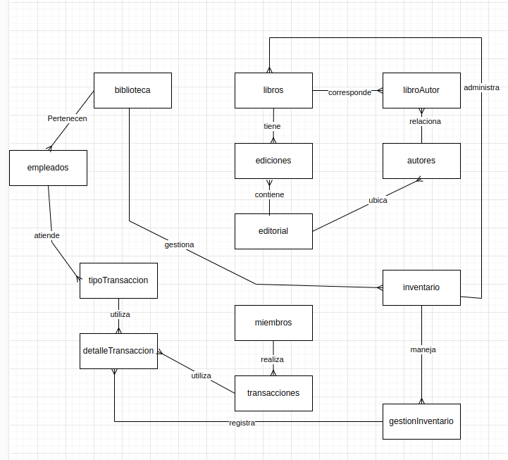
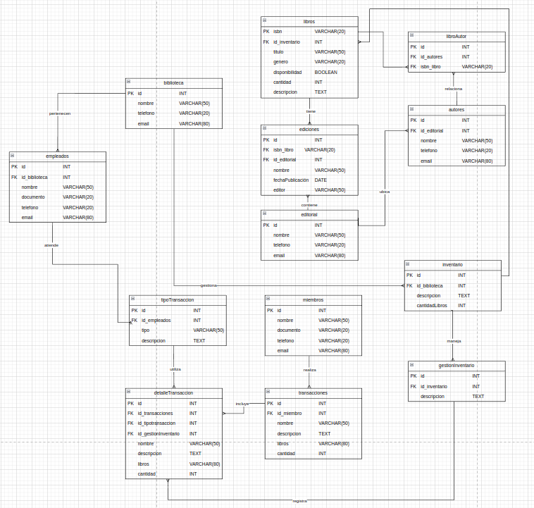

# Biblioteca Campus

## Descripción

En este proyecto se presenta el diseño de una base de datos para una biblioteca en el que se regitra la disponibilidad de libros en la misma por medio de su inventario.

## Diagrama UML

- **Modelo conceptual:**

    

- **Modelo físico:**

    